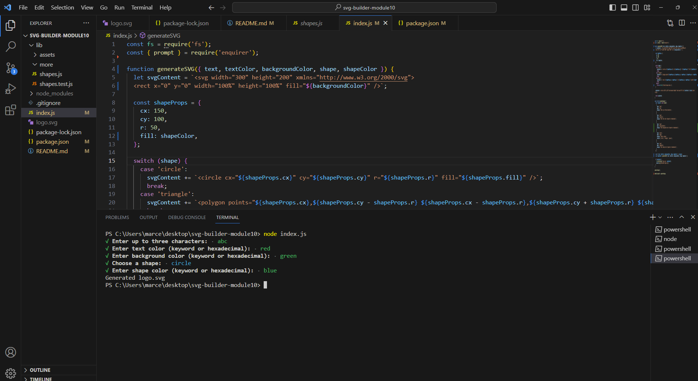

# SVG-BUILDER-MODULE10

## Description

The SVG Logo Generator is a command-line tool that allows you to easily create custom SVG logos by specifying text, colors, and shapes. This tool uses the Node.js environment along with the 'enquirer' library for user input and the 'fs' module for file writing.

walktrough video: https://drive.google.com/file/d/1RR39bbCg-66AvBMJGUpEmFFeG3sBZtYm/view

### Credits

Completion of the project was done with the help of Tutors